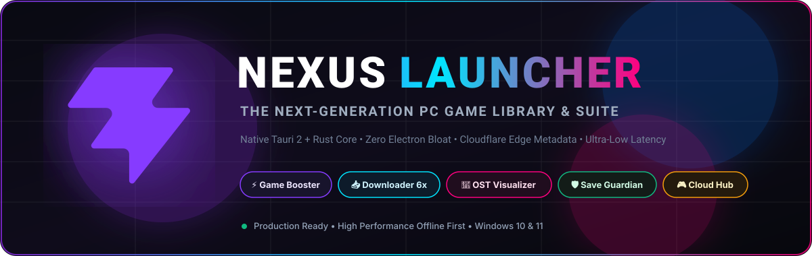



  <!-- Main Animated Hero Banner -->
  

  

  <!-- Interactive Typing Subtitle -->
  

  

    <strong>A blazing-fast, offline-first personal PC game library &amp; gaming suite powered by Tauri 2, Rust &amp; React 19.</strong>
     
    <em>No telemetry • No forced stores • No bloat • Pure native performance</em>
  

  <!-- Shields Badges Row -->
  

    
    
    
    
    
    
    
    
  

  <!-- Quick Navigation Pills -->
  

    <a href="#-key-features"><b>Key Features</b></a> •
    <a href="#-technical-architecture"><b>Architecture</b></a> •
    <a href="#-nexus-vs-alternatives"><b>Comparison</b></a> •
    <a href="#-getting-started"><b>Quick Start</b></a> •
    <a href="#-بخش-فارسی-راهنمای-جامع-نکسوس"><b>راهنمای فارسی 🇮🇷</b></a>
  

  

 

## 🌟 Overview / نگاه کلی

**Nexus Launcher** is engineered from scratch to solve the bloat, sluggishness, and memory hogging of modern game launchers. Traditional desktop managers wrap heavy Chromium instances with dozens of background telemetry processes. Nexus changes the game:

- **~60 MB RAM Idle Footprint** (compared to 800MB+ in GOG Galaxy or Steam)
- **Sub-Second Cold Boot** thanks to native Rust compilation and local SQLite caching
- **Zero Configuration Cloud Gateway**: Live IGDB & SteamGridDB metadata stream through a global Cloudflare Edge proxy without needing personal API keys or dealing with regional censorship/VPNs.
- **Unified Game OS Experience**: Game Booster, Parallel Downloader, Soundtrack Player, and Save Guardian all in one cohesive, cyberpunk-inspired glassmorphic interface.

---

## 🚀 Key Features

<table>
  <tr>
    <td width="50%" valign="top">
      <h3>⚡ Game Booster Pro</h3>
      <ul>
        <li><b>RAM Trimming:</b> Flushes unused working sets and system idle tasks across running processes.</li>
        <li><b>Power Plan Overdrive:</b> Switches OS dynamically to Ultra-High Performance on game launch, auto-reverts on exit.</li>
        <li><b>App Neutralizer:</b> Suspends 21+ known background resource hogs without touching launchers.</li>
        <li><b>Temp Purger:</b> Safely clears loose temp clutter to eliminate micro-stutters.</li>
        <li><b>Auto-Boost:</b> Transparently engages before every game launch.</li>
      </ul>
    </td>
    <td width="50%" valign="top">
      <h3>📥 Parallel Chunk Downloader</h3>
      <ul>
        <li><b>6x Multi-Connection Engine:</b> Splits downloads into parallel Range requests for maximum bandwidth utilization.</li>
        <li><b>Bulletproof Pause &amp; Resume:</b> Chunk states persisted in SQLite JSON for instant recovery across app restarts.</li>
        <li><b>Automated Zip Extraction:</b> Unpacks archives automatically in background.</li>
        <li><b>Smart Exe Heuristics:</b> Scores binaries by directory depth, size, and naming patterns to auto-detect the playable executable.</li>
      </ul>
    </td>
  </tr>
  <tr>
    <td width="50%" valign="top">
      <h3>🎵 Soundtrack Center &amp; Visualizer</h3>
      <ul>
        <li><b>Real-Time Audio Visualizer:</b> Smooth 60 FPS Canvas spectrum analyzer reacting to game beats.</li>
        <li><b>Multi-Provider Aggregation:</b> YouTube Direct, KHInsider, Internet Archive, Audius, MusicBrainz, and Local Files.</li>
        <li><b>Mini &amp; Expanded Player:</b> Compact floating widget or full-screen immersive playback.</li>
        <li><b>Offline Library:</b> Download tracks locally with automated metadata tagging.</li>
      </ul>
    </td>
    <td width="50%" valign="top">
      <h3>🛡️ Safe Save Guardian</h3>
      <ul>
        <li><b>Multi-Profile Isolation:</b> Separate saves and playthroughs per player profile on a single machine.</li>
        <li><b>ACID Journal Engine:</b> Atomic operations prevent corrupt saves during power cuts or crashes.</li>
        <li><b>Auto-Detection:</b> Pre-configured heuristics for Steam AppIDs, Unity, Call of Duty, PES, and major publishers.</li>
        <li><b>One-Click Restore:</b> Roll back to any snapshot instantly with integrity checks.</li>
      </ul>
    </td>
  </tr>
  <tr>
    <td width="50%" valign="top">
      <h3>🎮 Cloud Game Hub &amp; Wishlist</h3>
      <ul>
        <li><b>Cloudflare Edge Gateway:</b> Free, permanent, high-speed metadata proxy without entering API keys.</li>
        <li><b>Coming Soon (Chronological):</b> Real-time upcoming releases sorted by arrival date.</li>
        <li><b>Similar Games Engine:</b> Smart IGDB recommendation algorithm matching your taste.</li>
        <li><b>Wishlist Tracker:</b> Monitor upcoming games and move to active library with one click.</li>
      </ul>
    </td>
    <td width="50%" valign="top">
      <h3>📊 Gamer Passport &amp; Analytics</h3>
      <ul>
        <li><b>91-Day Activity Heatmap:</b> GitHub-style visualization of daily gaming hours.</li>
        <li><b>Gaming Habits Radar:</b> Hourly breakdown revealing your peak gaming sessions.</li>
        <li><b>Gamer Level &amp; Milestones:</b> XP system based on playtime, library diversity, and completion.</li>
        <li><b>Precision Session Tracking:</b> Background Rust thread monitors active PIDs without CPU drain.</li>
      </ul>
    </td>
  </tr>
</table>

---

## ⚡ Nexus vs. Alternatives

| Feature                                |         🪐 Nexus Launcher          |     💨 Steam     |  🌌 GOG Galaxy   |      🎮 Playnite      |
| :------------------------------------- | :--------------------------------: | :--------------: | :--------------: | :-------------------: |
| **Tech Stack**                         |   **Tauri 2 (Rust) + React 19**    |  CEF (Chromium)  |  CEF (Chromium)  |      .NET / WPF       |
| **Idle RAM Usage**                     |          **~55 – 70 MB**           |   600 – 900 MB   |  700 – 1,100 MB  |     250 – 450 MB      |
| **Startup Speed**                      |      **Instant (&lt; 0.6s)**       |     5 – 12s      |     8 – 20s      |        3 – 7s         |
| **Accounts / Forced Sign-In**          |     **❌ None (100% Offline)**     |    Mandatory     |    Mandatory     |       Optional        |
| **Cloud Metadata Proxy**               |    **✅ Built-in Edge Gateway**    |  Internal Only   | Plugins Required |     Personal Keys     |
| **Integrated Game Booster**            |   **✅ 6-Engine Hardware Boost**   |      ❌ No       |      ❌ No       | ❌ Third-party plugin |
| **Chunked Multi-Thread Downloader**    | **✅ Built-in (Resume + Extract)** |    Store Only    |    Store Only    |         ❌ No         |
| **Soundtrack Player &amp; Visualizer** |    **✅ Built-in Audio Engine**    | Basic MP3 Player |      ❌ No       | ❌ Third-party plugin |
| **Transactional Save Manager**         | **✅ Multi-Profile ACID Journal**  | Cloud Sync Only  | Cloud Sync Only  |     Basic Backup      |
| **UI Aesthetics**                      | **Glassmorphism &amp; Cyberpunk**  |   Static Skin    |      Static      |        Themes         |

---

## 🛠️ Technical Architecture

`mermaid
flowchart TD
subgraph Frontend["Frontend Layer (React 19 + TypeScript + Vite 8)"]
UI["Cyberpunk Glassmorphism UI (Tailwind 4 + Sora)"]
Motion["Framer Motion 13 (60 FPS Animations)"]
State["Zustand Stores + TanStack Query v5"]
Player["Soundtrack Audio Visualizer (Web Audio API)"]
end

subgraph IPC["Tauri v2 IPC Bridge"]
Invoke["Type-Safe invoke() Calls"]
Events["Asynchronous Event Streams (Download / Playtime / Booster)"]
end

subgraph Backend["Backend Engine (Rust 2021)"]
Booster["Game Booster Engine (Sysinfo, Win32 API, Powercfg)"]
Downloader["Chunk Downloader (Reqwest, Async Tokio, Multi-Stream)"]
Saves["Save Guardian (ACID Journal, Zip, FsOps)"]
Resolver["Metadata Resolver &amp; Circuit Breaker"]
DB[("SQLite Database (rusqlite, WAL Mode, Versioned Migrations)")]
end

subgraph Cloud["Nexus Cloud (Global Edge)"]
Worker["Cloudflare Edge Worker Gateway"]
IGDB["Twitch / IGDB API"]
SGDB["SteamGridDB API"]
SteamStore["Steam Official CDN"]
end

UI --> State
State --> Invoke
Events --> State
Invoke --> Backend
Backend --> Events
Resolver --> Worker
Worker --> IGDB
Worker --> SGDB
Worker --> SteamStore
Backend --> DB
`

---

## 📦 Getting Started

### Prerequisites

Ensure you have the following installed on your Windows machine:

1. **Node.js 20+** — [Download Node.js](https://nodejs.org/)
2. **Rust &amp; Cargo** — [Install Rust via rustup](https://rustup.rs/)
3. **Microsoft C++ Build Tools &amp; WebView2** (included by default on Windows 10 & 11)

### Installation &amp; Launch

`ash

# 1. Clone the repository

git clone https://github.com/AminDEV81/nexus-launcher.git
cd nexus-launcher

# 2. Install frontend dependencies

npm install

# 3. Run development desktop app (Hot Module Replacement enabled)

npm run tauri dev
`

### Production Build

To build a standalone, optimized Windows .exe installer:
`ash
npm run tauri build
`
The resulting executable will be available in src-tauri/target/release/bundle/msi/.

---

  

 

<!-- ===================================================================== -->
<!-- PERSIAN DOCUMENTATION SECTION (بخش مستندات کامل به زبان فارسی)          -->
<!-- ===================================================================== -->

# 🇮🇷 بخش فارسی: راهنمای جامع نکسوس (Nexus Launcher)

> **نکسوس (Nexus)**، نسل نوین لانچرهای بازی برای رایانه‌های شخصی است. تلفیقی بی‌نظیر از قدرت و سرعت **Rust** در هسته پردازشی، زیبایی خیره‌کننده رابط کاربری شیشه‌ای (**Glassmorphic & Cyberpunk**) با **React 19** و معماری سبک **Tauri 2**.

---

### 🎯 چرا نکسوس؟

اکثر لانچرهای امروزی (نظیر استیم، گلکسی و اپیک) بر پایه فریمورک‌های سنگین تحت وب طراحی شده‌اند و هنگام اجرای بازی‌ها صدها مگابایت رم را اشغال کرده و سیستم را تحت فشار می‌گذارند. **نکسوس** با رویکرد **Native و Offline-First** طراحی شده است:

- **مصرف رم کمتر از ۶۰ مگابایت** (به جای ۸۰۰ تا ۱۰۰۰ مگابایت در سایر لانچرها)
- **لود شدن آنی در کسری از ثانیه** بدون معطلی و بدون نیاز به ورود به اکانت
- **کاملاً آفلاین با امنیت کامل** بدون هیچ‌گونه ردیابی یا تبلیغات مزاحم

---

### ✨ قابلیت‌ها و ماژول‌های اختصاصی

#### ۱. ⚡ بوستر پیشرفته بازی‌ها (Game Booster Pro)

دیگر نیازی به نصب نرم‌افزارهای جداگانه بهینه‌ساز ندارید؛ نکسوس دارای ۶ موتور بهینه‌سازی مستقل است:

- **پاکسازی رم (RAM Trimming):** تخلیه هوشمند حافظه کاری برنامه‌های بلااستفاده پیش از ورود به بازی.
- **تنظیم مصرف برق (High Performance):** انتقال خودکار سیستم به حداکثر کارایی سخت‌افزاری و بازگردانی آن پس از خروج از بازی.
- **توقف برنامه‌های پس‌زمینه:** متوقف‌سازی ۲۱ پردازش غیرضروری ویندوز بدون تداخل با سایر لانچرها.
- **پاکسازی فایل‌های زائد Temp:** برطرف‌سازی لگ‌های ریز ناشی از پر شدن دیسک.
- **حالت اختصاصی Auto-Boost:** فعال‌سازی خودکار قبل از اجرای هر بازی.

#### ۲. 📥 دانلود منیجر قدرتمند موازی (Chunk Downloader)

- دانلود فوق‌سریع بازی‌ها با تقسیم فایل به **۶ اتصال موازی همزمان (Range Requests)**.
- پشتیبانی کامل از **توقف و ادامه (Pause / Resume)** با ذخیره دقیق موقعیت هر قطعه در دیتابیس.
- **اکسترکت خودکار:** استخراج خودکار فایل‌های فشرده Zip پس از پایان دانلود.
- **شناسایی هوشمند فایل اجرایی (Exe Finder):** یافتن خودکار فایل اصلی بازی بر اساس الگوهای هوشمند و عمق پوشه.

#### ۳. 🎵 مرکز موسیقی و ساندترک بازی‌ها (Soundtrack Center)

- **ویژوالایزر صوتی زنده (Real-Time 60 FPS):** طیف‌سنج بصری فوق‌العاده با هماهنگی فرکانسی موزیک بازی.
- **پشتیبانی از چندین منبع معتبر:** پخش و استریم از YouTube Direct، KHInsider، Internet Archive، Audius و فایل‌های محلی.
- **پخش‌کننده شناور و مینی:** کنترل آسان موزیک در حین کار بدون اشغال فضای صفحه.

#### ۴. 🛡️ محافظ امنیتی سیوها (Safe Save Guardian)

- **پشتیبانی از چند پروفایل (Multi-Profile):** مناسب برای سیستم‌های خانگی مشترک با ایزوله‌سازی کامل سیوهای هر کاربر.
- **سیستم ژورنال اتمیک (ACID):** جلوگیری قطعی از خراب شدن فایل‌های ذخیره در صورت قطعی برق یا کرش بازی.
- **تشخیص خودکار مسیر سیو:** الگوریتم اختصاصی برای بازی‌های استیم، یونیتی، Call of Duty، PES و سایر عناوین.

#### ۵. 🎮 هاب ابری بدون نیاز به فیلترشکن (Cloudflare Edge Gateway)

- اتصال مستقیم به ورکر ابری اختصاصی نکسوس روی شبکه جهانی کلودفلر.
- دریافت تمام متادیتاها، پوسترها، بنرها و نمرات بازی‌ها از **IGDB و SteamGridDB** به صورت رایگان، فوق‌سریع و بدون نیاز به ورود هیچ‌گونه API Key توسط کاربر.
- **بخش بازی‌های آینده (Coming Soon):** چینش دقیق بر اساس نزدیک‌ترین تاریخ انتشار بازی‌ها در روزهای آتی.

---

### 💻 دستورات و راه‌اندازی سریع

`ash

# دریافت سورس کد پروژه

git clone https://github.com/AminDEV81/nexus-launcher.git
cd nexus-launcher

# نصب کتابخانه‌ها

npm install

# اجرای برنامه در حالت توسعه (Live Dev)

npm run tauri dev

# بیلد نهایی و ساخت فایل نصبی ویندوز (.exe)

npm run tauri build
`

---

  
طراحی و توسعه داده شده با عشق و بالاترین استانداردهای مهندسی نرم‌افزار 🖤

  
<b>Developer: Amin (<a href="https://github.com/AminDEV81">@AminDEV81</a>)</b>

